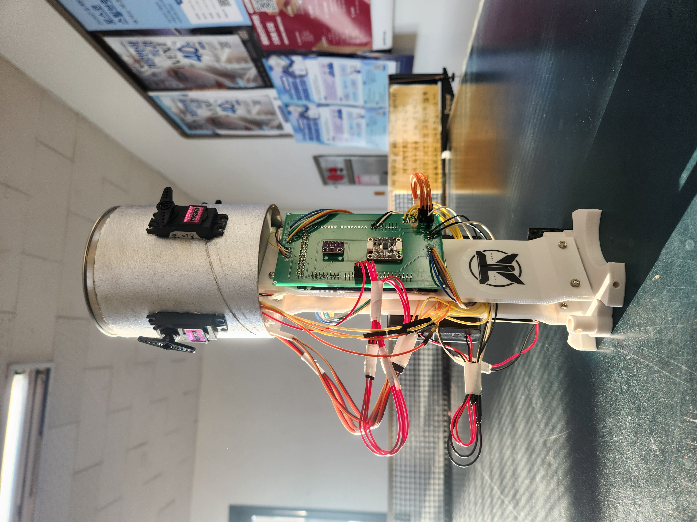
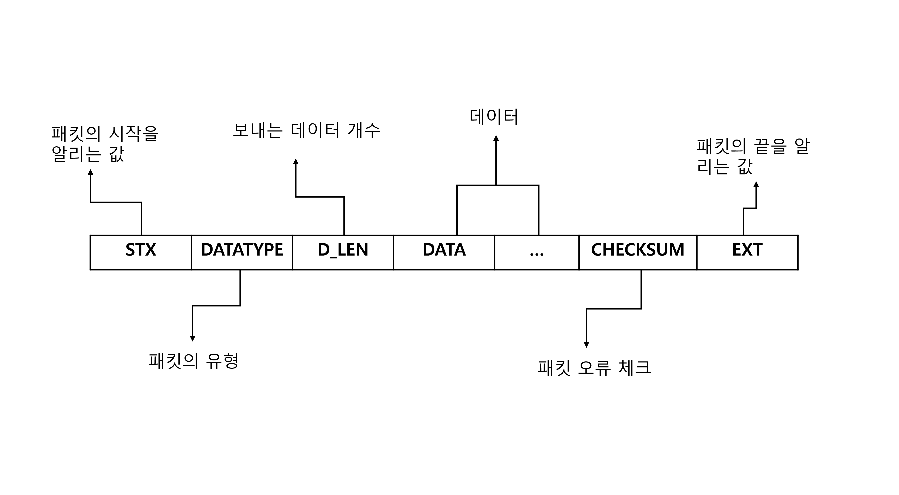
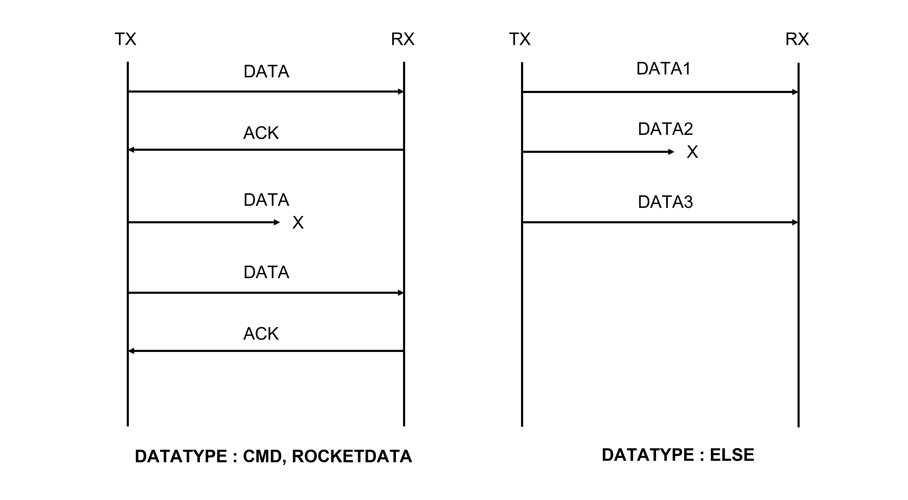
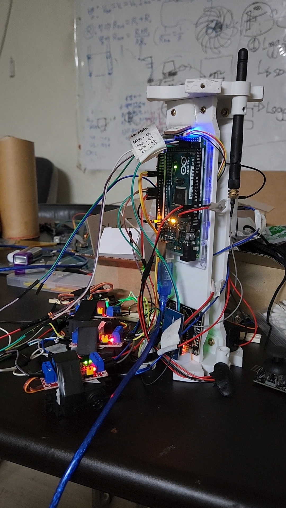
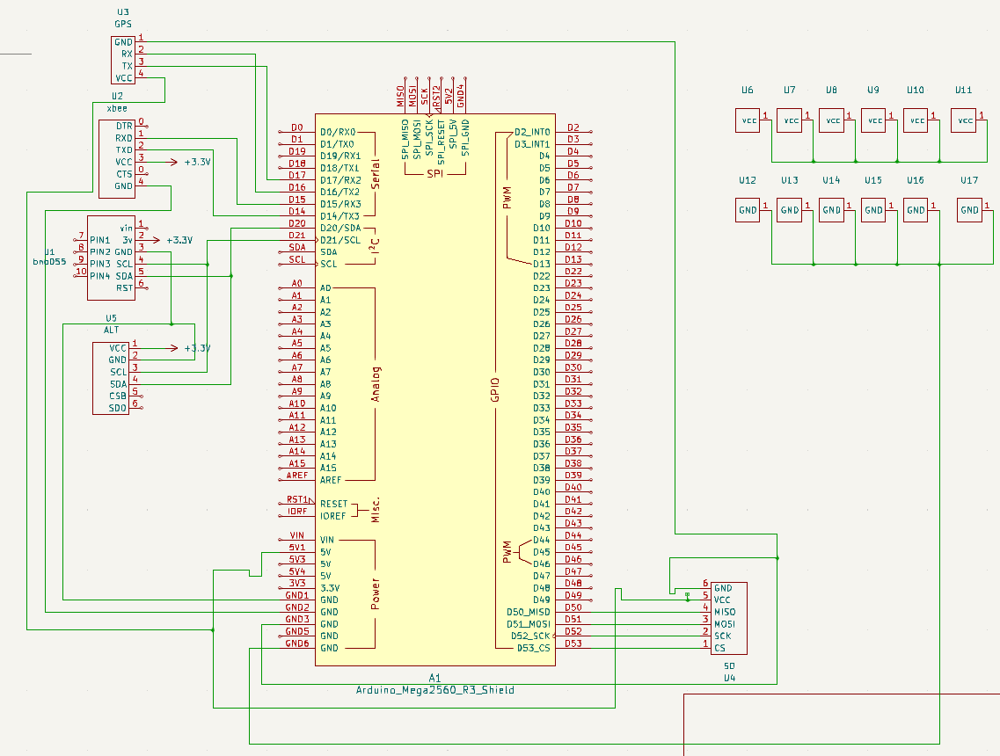
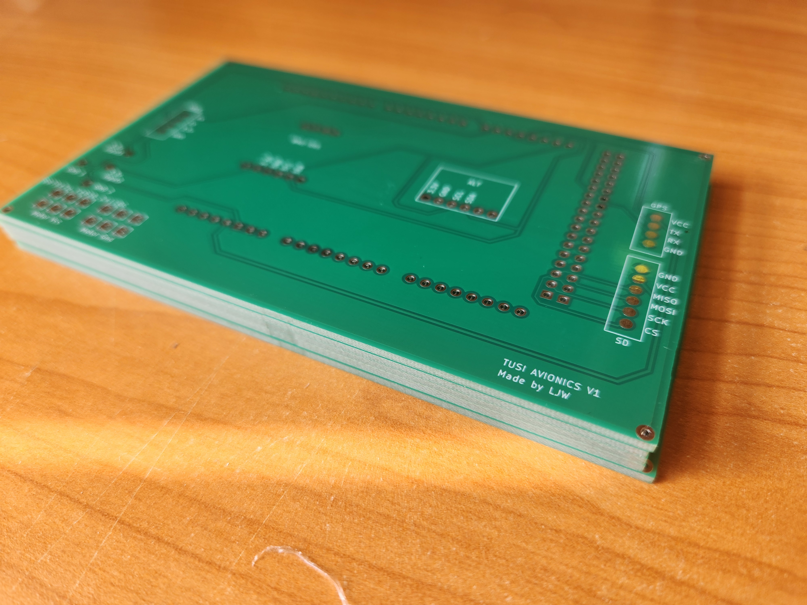
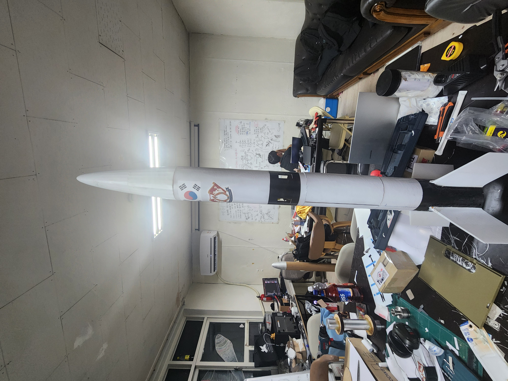
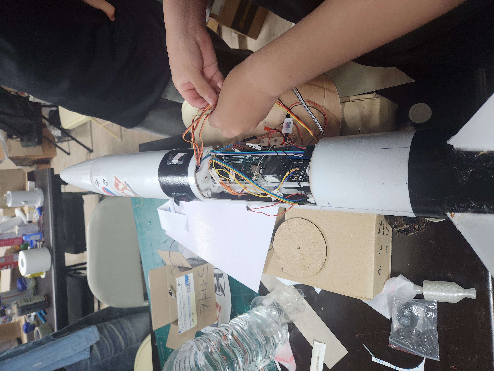

# Arduino rocket avionics firmware platform

This project provides a framework for Arduino to quickly build and maintain Rocket Avionics and can be expanded according to the user's intentions. Users can easily add various sensors they want to use to the Avionics system, set them to perform custom missions, and help manage mission performance by flight stage throughout the entire flight process. This is significant in that it provides an expandable avionics framework based on Arduino, which is easily accessible, instead of existing expensive avionics such as Pixhawk. In addition, it provides not only software but also hardware design that includes basic sensors needed for avionics, helping to produce a low-cost avionics system in a short time.

## feature
1. Quick and convenient sensor addition and management
2. Custom launch stages and mission control
3. Providing communication packets for efficient telemetry transmission and reception with ground stations
4. High reusability and maintainability
5. Provide hardware circuit design
6. support canard fin pid control

## software architecture

## packet architecture
In order to reduce unnecessary bit transmission during the communication process and ensure communication reliability and real-time, packets were designed and protocols were created.

Data types are classified as follows. At this time, rocketstate, cmd, etc. must transmit and receive data accurately, so like the TCP protocol, when data is received from the receiver, it sends an ACK to the transmitter. If the ACK is not received from the transmitter, it is designed to transmit the data one more time. Like sensor telemetry, it sends an ACK to the transmitter. Data where real-time is important were excluded from this process.

## hardware
The hardware basically consists of GPS, IMU, barometer, SD reader, motor, and communication module. In addition, the user can replace and add sensors as needed. The initial version of the hardware used a breadboard, and the latest version had a new PCB design to increase stability.
excluded from this process.

